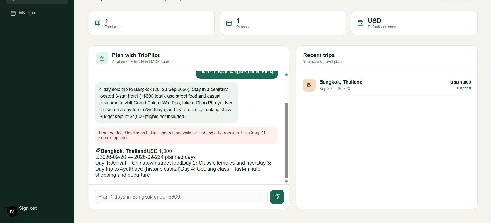
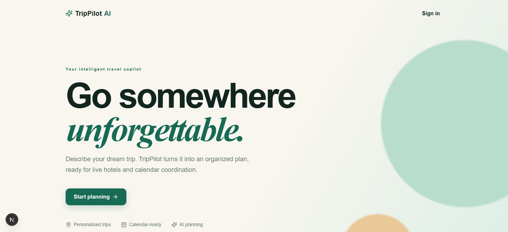
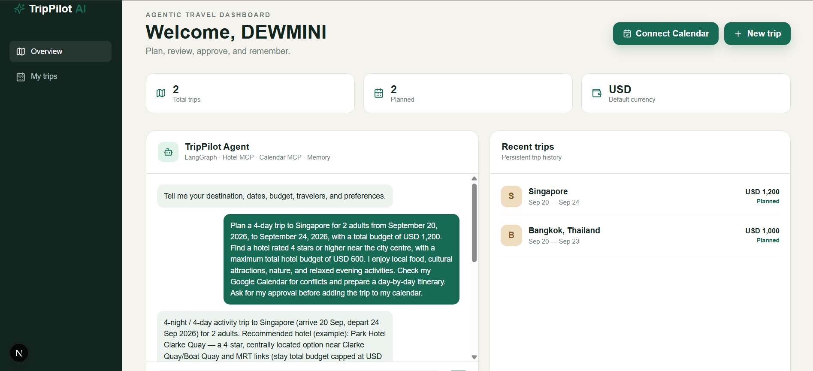
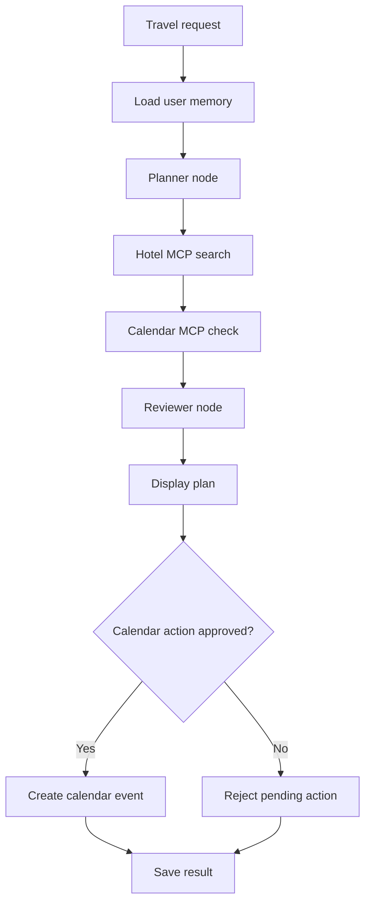
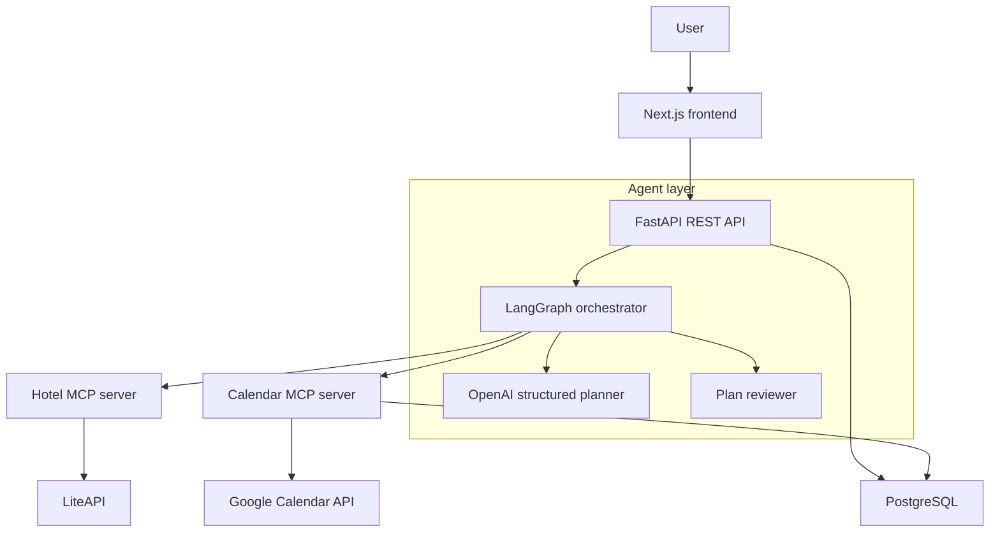
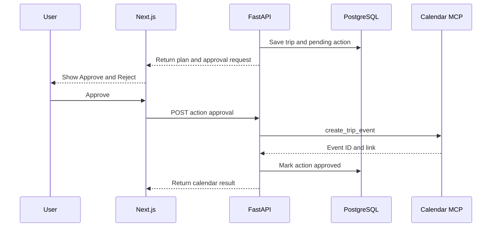
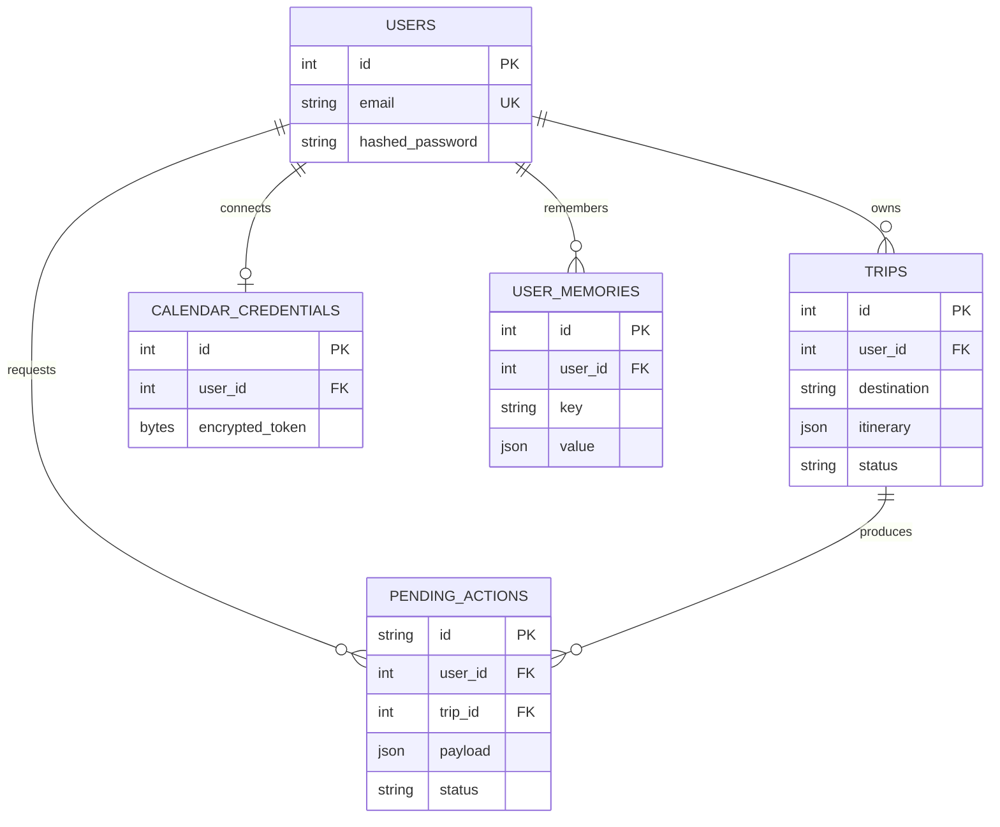

# TripPilot AI — Agentic Travel Assistant

TripPilot AI is a full-stack agentic travel-planning application. It converts a natural-language request into a structured itinerary, searches live hotel offers, checks Google Calendar availability, remembers user preferences, reviews its plan, and requests human approval before creating a calendar event.

This portfolio project demonstrates full-stack engineering, structured LLM output, LangGraph orchestration, Model Context Protocol (MCP), persistent memory, OAuth 2.0, external APIs, and human-in-the-loop safety.

> The current hotel integration uses LiteAPI. This project does not claim an Airbnb integration. The original Amadeus self-service implementation was replaced after that service was decommissioned.

## Screenshots

Place `screenshot1.png`, `screenshot2.png`, and `screenshot3.png` in the repository root beside this README.

### Dashboard



### AI trip plan and live hotel results



### Google Calendar and human approval workflow



## Features

### Stage 1 — Full-stack foundation

- Next.js dashboard, landing page, registration, and login
- JWT authentication and protected API requests
- Argon2 password hashing
- Create, view, list, and delete trips
- User-specific trip history
- PostgreSQL, SQLAlchemy, and Alembic migrations
- Docker Compose development environment
- FastAPI health endpoint and interactive API documentation

### Stage 2 — Structured AI planner

- Natural-language travel requests
- OpenAI Responses API with Pydantic structured output
- Destination, IATA city code, dates, travelers, currency, and budget extraction
- Daily itineraries with activities and estimated costs
- Conservative assumptions for incomplete requests
- Persisted prompts and generated itineraries
- Budget allocation validation

### Stage 3 — Live Hotel MCP

- Independent MCP server using streamable HTTP
- LiteAPI-backed accommodation search
- Search by destination, dates, travelers, currency, rating, and budget
- Normalized, filtered, and ranked hotel results
- Graceful provider-error handling

### Stage 4 — Google Calendar MCP and OAuth

- Google OAuth 2.0 web-server flow
- Calendar connection status in the dashboard
- Calendar free/busy conflict detection
- Calendar-event creation through MCP
- Encrypted refresh-token storage using Fernet
- Signed OAuth state
- Human approval before calendar writes

### Stage 5 — LangGraph orchestration and memory

- Planner, hotel, calendar, and reviewer nodes
- Thread-scoped short-term LangGraph state
- Persistent user preferences in PostgreSQL
- Memory for currency, hotel rating, traveler count, and recent destination
- Deterministic budget and calendar checks
- Auditable pending approve/reject actions
- Combined plan, hotel, calendar, and review results in the dashboard

## Agent workflow



## System architecture



## Human-in-the-loop flow



## Tools and technologies

| Layer | Tools and technologies |
|---|---|
| Frontend | Next.js 16, React 19, TypeScript, CSS, Lucide React |
| Backend | Python 3.12, FastAPI, Uvicorn, Pydantic |
| AI | OpenAI Responses API, structured outputs |
| Orchestration | LangGraph, state graph, in-memory checkpointer |
| Tool protocol | Model Context Protocol, Python MCP SDK, streamable HTTP |
| Hotels | LiteAPI, Hotel MCP server, HTTPX |
| Calendar | Google Calendar API, OAuth 2.0, Google API Python client |
| Authentication | JWT, PyJWT, Argon2 |
| Security | Fernet encryption, signed OAuth state, ownership checks |
| Database | PostgreSQL 16, SQLAlchemy 2, Alembic, Psycopg 3 |
| Infrastructure | Docker, Docker Compose |
| Testing | Pytest, HTTPX |
| Tooling | npm, TypeScript compiler, Git, GitHub |

## Project structure

```text
agentic-ai-travel-assistant/
├── backend/
│   ├── alembic/versions/
│   │   ├── 001_initial.py
│   │   └── 002_calendar_memory.py
│   ├── app/
│   │   ├── api/routes/
│   │   │   ├── agent.py
│   │   │   ├── auth.py
│   │   │   ├── calendar.py
│   │   │   ├── hotels.py
│   │   │   └── trips.py
│   │   ├── core/
│   │   ├── db/
│   │   ├── graph/
│   │   │   ├── state.py
│   │   │   └── travel_graph.py
│   │   ├── mcp/
│   │   │   ├── calendar_server.py
│   │   │   └── hotel_server.py
│   │   ├── models/
│   │   ├── schemas/
│   │   ├── services/
│   │   │   ├── calendar_mcp.py
│   │   │   ├── google_calendar.py
│   │   │   ├── hotel_mcp.py
│   │   │   ├── liteapi.py
│   │   │   ├── memory.py
│   │   │   ├── planner.py
│   │   │   └── token_crypto.py
│   │   └── main.py
│   ├── tests/
│   ├── Dockerfile
│   └── requirements.txt
├── frontend/
│   ├── src/
│   │   ├── app/
│   │   │   ├── dashboard/
│   │   │   ├── login/
│   │   │   └── register/
│   │   ├── components/
│   │   │   ├── AuthForm.tsx
│   │   │   ├── CalendarConnect.tsx
│   │   │   ├── ChatPanel.tsx
│   │   │   └── NewTripForm.tsx
│   │   └── lib/api.ts
│   ├── Dockerfile
│   ├── package.json
│   └── tsconfig.json
├── .env.example
├── docker-compose.yml
├── screenshot1.png
├── screenshot2.png
├── screenshot3.png
└── README.md
```

## Database model



## Prerequisites

- Docker Desktop with the Linux engine running
- Git
- OpenAI Platform account with API credit
- LiteAPI developer account and API key
- Google Cloud project with Google Calendar API enabled
- Google OAuth web client

Node.js and Python are only required when services run outside Docker.

## Environment variables

Copy the example:

```bash
cp .env.example .env
```

Windows Command Prompt:

```bat
copy .env.example .env
```

Configure the root `.env`:

```env
POSTGRES_DB=travel_agent
POSTGRES_USER=travel
POSTGRES_PASSWORD=travel_dev_password
DATABASE_URL=postgresql+psycopg://travel:travel_dev_password@db:5432/travel_agent

JWT_SECRET=replace-with-a-long-random-secret
JWT_ALGORITHM=HS256
ACCESS_TOKEN_EXPIRE_MINUTES=1440

BACKEND_CORS_ORIGINS=http://localhost:3000
NEXT_PUBLIC_API_URL=http://localhost:8000/api/v1

OPENAI_API_KEY=your_openai_api_key
OPENAI_MODEL=gpt-5-mini

LITEAPI_API_KEY=your_liteapi_api_key
LITEAPI_BASE_URL=https://api.liteapi.travel/v3.0
LITEAPI_GUEST_NATIONALITY=LK
HOTEL_MCP_URL=http://hotel-mcp:8001/mcp

GOOGLE_CLIENT_ID=your_client_id.apps.googleusercontent.com
GOOGLE_CLIENT_SECRET=your_google_client_secret
GOOGLE_REDIRECT_URI=http://localhost:8000/api/v1/calendar/oauth/callback
GOOGLE_OAUTH_SUCCESS_URL=http://localhost:3000/dashboard?calendar=connected
CALENDAR_MCP_URL=http://calendar-mcp:8002/mcp
TOKEN_ENCRYPTION_KEY=your_fernet_key
```

Never commit `.env`, API keys, OAuth secrets, or tokens.

| Variable | Obtain from | Purpose |
|---|---|---|
| `OPENAI_API_KEY` | OpenAI Platform | Structured plan generation |
| `LITEAPI_API_KEY` | LiteAPI developer portal | Live hotel offers |
| `GOOGLE_CLIENT_ID` | Google Cloud OAuth client | Start authorization |
| `GOOGLE_CLIENT_SECRET` | Google Cloud OAuth client | Exchange OAuth codes |
| `TOKEN_ENCRYPTION_KEY` | Generate locally | Encrypt Google credentials |

Generate a Fernet key:

```bash
docker compose run --rm backend python -c "from cryptography.fernet import Fernet; print(Fernet.generate_key().decode())"
```

## Google OAuth setup

1. Create or select a Google Cloud project.
2. Enable Google Calendar API.
3. Configure **Google Auth Platform → Branding**.
4. Under **Audience**, choose **External**, keep testing mode, and add your Google email as a test user.
5. Under **Data Access**, add the minimum Calendar scopes used by the backend.
6. Under **Clients**, create a **Web application** OAuth client.
7. Add JavaScript origin `http://localhost:3000`.
8. Add the exact redirect URI:

   ```text
   http://localhost:8000/api/v1/calendar/oauth/callback
   ```

9. Copy the client ID and secret into `.env`.

Do not add a trailing slash to the redirect URI.

## Run with Docker

```bash
docker compose up --build
```

| Service | Address |
|---|---|
| Web app | <http://localhost:3000> |
| FastAPI docs | <http://localhost:8000/docs> |
| Health check | <http://localhost:8000/health> |
| Hotel MCP | <http://localhost:8001/mcp> |
| PostgreSQL from host | `localhost:5433` |
| Calendar MCP inside Docker | `http://calendar-mcp:8002/mcp` |

Migrations run automatically when the backend starts.

```bash
docker compose ps
docker compose logs -f backend
docker compose logs -f frontend
docker compose logs -f hotel-mcp
docker compose logs -f calendar-mcp
docker compose down
```

## API endpoints

Protected endpoints require `Authorization: Bearer <jwt-token>`.

| Method | Endpoint | Description |
|---|---|---|
| `GET` | `/health` | Health check |
| `POST` | `/api/v1/auth/register` | Register and receive JWT |
| `POST` | `/api/v1/auth/login` | Log in and receive JWT |
| `GET` | `/api/v1/auth/me` | Current user |
| `GET/POST` | `/api/v1/trips` | List or create trips |
| `GET/DELETE` | `/api/v1/trips/{trip_id}` | Read or delete an owned trip |
| `POST` | `/api/v1/agent/plan` | Generate a structured plan |
| `POST` | `/api/v1/agent/run` | Run the complete agent graph |
| `POST` | `/api/v1/hotels/search` | Search through Hotel MCP |
| `GET` | `/api/v1/calendar/oauth/start` | Generate Google authorization URL |
| `GET` | `/api/v1/calendar/oauth/callback` | Handle OAuth callback |
| `GET` | `/api/v1/calendar/status` | Calendar connection status |
| `POST` | `/api/v1/agent/actions/{id}/approve` | Execute approved calendar action |
| `POST` | `/api/v1/agent/actions/{id}/reject` | Reject pending action |

## MCP tools

| Server | Tool | Purpose |
|---|---|---|
| Hotel MCP | `search_hotels` | Search and normalize hotel offers |
| Hotel MCP | `compare_hotels` | Rank offers by rating and price |
| Calendar MCP | `check_availability` | Read primary-calendar busy periods |
| Calendar MCP | `create_trip_event` | Create an approved trip event |

## Security

- Passwords are hashed, never stored as plain text.
- JWTs protect user-specific endpoints.
- Database queries enforce authenticated ownership.
- Google credentials are encrypted before storage.
- OAuth state is signed.
- Secrets remain server-side in environment variables.
- Calendar writes are stored as pending actions.
- External actions require explicit approval.

## Testing

```bash
docker compose run --rm backend pytest
docker compose run --rm frontend npm run build
docker compose run --rm backend alembic upgrade head
```

## Troubleshooting

### Docker daemon unavailable

Start Docker Desktop and wait for its Linux engine. On Windows:

```powershell
wsl --shutdown
```

Restart Docker Desktop afterward.

### Docker overlay filesystem input/output error

```bash
docker compose down
docker builder prune -f
docker compose build --no-cache frontend
docker compose up
```

Do not run `docker system prune --volumes` unless PostgreSQL is backed up.

### Google `redirect_uri_mismatch`

Google Cloud and `.env` must both contain exactly:

```text
http://localhost:8000/api/v1/calendar/oauth/callback
```

### Google OAuth access denied

Keep the application in testing mode, add your email as a test user, and sign in with that exact account.

### OpenAI `429 insufficient_quota`

Add API billing credit or use a funded project/API key. A ChatGPT subscription does not include OpenAI API credit.

### Hotel MCP cannot start

Verify that `config.py` defines `liteapi_api_key`, `liteapi_base_url`, and `liteapi_guest_nationality`, then run:

```bash
docker compose logs hotel-mcp
```

### Frontend returns 403

The JWT is missing or invalid. Clear the browser's `token` local-storage value and sign in again.

### Next.js cannot resolve `@/...`

Confirm `frontend/tsconfig.json` includes:

```json
{
  "compilerOptions": {
    "baseUrl": ".",
    "paths": {
      "@/*": ["./src/*"]
    }
  }
}
```

Confirm source files have real `.ts` or `.tsx` extensions, not hidden `.txt` extensions.

## Current limitations

- In-memory LangGraph checkpoints are lost after a backend restart.
- Persistent memory is structured JSON rather than vector memory.
- Hotel results depend on LiteAPI coverage and limits.
- The application does not book or charge for hotels.
- OAuth testing mode permits only configured test users.
- Production requires HTTPS, durable checkpoints, secret management, rate limiting, monitoring, and strict CORS.

## Future improvements

- PostgreSQL or Redis LangGraph checkpoints
- Redis caching and background jobs
- Semantic memory using pgvector
- Calendar disconnect and token revocation
- Provider retries and circuit breakers
- Rate limiting, logging, tracing, and metrics
- MCP contract and Playwright end-to-end tests
- GitHub Actions and production deployment

## CV-ready description

**Agentic AI Travel Assistant — Personal Project**

Built a full-stack agentic travel assistant using Next.js, FastAPI, LangGraph, OpenAI structured outputs, MCP tool servers, PostgreSQL, LiteAPI, and Google Calendar OAuth. Implemented live hotel search, stateful multi-tool orchestration, persistent user preferences, deterministic plan review, encrypted OAuth-token storage, calendar conflict detection, and human approval before external actions.

## Disclaimer

TripPilot AI is an educational portfolio project. Hotel results must be confirmed with the provider. The application does not make bookings, collect payments, or guarantee availability or pricing.
